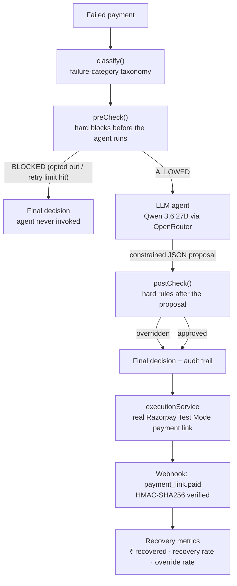

# Revenue Recovery Agent

**Razorpay AI Buildathon 2026 — Track 3: AI Revenue Recovery**


An AI agent that proposes a recovery action for a failed payment — but never gets the final word. A deterministic policy layer checks every proposal before anything executes, and every decision is logged end-to-end so the full reasoning behind any case can be reconstructed.

**The LLM proposes. The policy layer disposes.**

---

### Contents
- [The problem](#the-problem)
- [How it works](#how-it-works)
- [What's real vs. simulated](#whats-real-vs-simulated)
- [Tech stack](#tech-stack)
- [Repository structure](#repository-structure)
- [Running locally](#running-locally)
- [Dashboard](#dashboard)
- [Compliance framing](#compliance-framing)
- [Known limitations](#known-limitations)

---

## The problem

Indian merchants lose revenue quietly every time a payment fails and nobody follows up correctly: a card declines, a UPI transaction times out, a customer's mandate breaks mid-cycle. Manual recovery is slow and inconsistent, and it's rarely possible to say precisely how much money was actually won back versus just estimated.

A common shortcut is to hand the whole decision to an LLM: dump the failure into a prompt, let it decide what to do, execute whatever it says. That has no state machine, no stopping conditions, and no boundary between what the model decided and what the system allowed. This project is built specifically to avoid that pattern.

## How it works



The LLM's job is deliberately narrow: diagnose the likely cause and propose one action from a fixed, enumerated menu. It cannot invent an action, cannot execute anything directly, and cannot override a policy rule. If it proposes something wrong — for example, retrying a customer who already opted out — the policy layer overrides it, and that override is logged as a first-class event.

<details>
<summary><strong>Failure taxonomy</strong> (click to expand)</summary>
<br>

| Category | Typical cause |
|---|---|
| `insufficient_funds` | Not enough balance at time of charge |
| `expired_card` | Card past its expiry date |
| `authentication_3ds_failure` | OTP/3DS step failed or abandoned |
| `bank_unavailable` | Issuing bank/network temporarily down |
| `upi_timeout` | UPI request timed out before confirmation |
| `transaction_limit_exceeded` | Per-transaction or daily limit hit |
| `repeated_failure_same_reason` | Same failure recurring across attempts |
| `uncategorized` | Signal insufficient to assign a specific cause |

Each category carries defaults for recoverability, default action, retry policy, and priority. `classify()` maps real Razorpay failure signals onto these categories, falling back to `uncategorized` rather than guessing a cause the data doesn't support.
</details>

<details>
<summary><strong>Deterministic by design</strong> — what the LLM never decides (click to expand)</summary>
<br>

- Retry-attempt counting and max-attempt enforcement
- Opt-out / DND enforcement
- Amount-threshold routing to human escalation
- All audit-log writes
- The allowed final-action set: `retry_same_method`, `retry_after_delay`, `try_alternative_method`, `ask_customer_to_update_payment_method`, `send_payment_link`, `escalate`, `do_not_retry`
</details>

<details>
<summary><strong>Closed-loop confirmation</strong> (click to expand)</summary>
<br>

A recovery is not marked resolved the moment a payment link is generated — it's confirmed via Razorpay's `payment_link.paid` webhook, with HMAC-SHA256 signature verification and idempotent replay handling. A manual reconciliation action ("Check for payments") polls the same source of truth as a fallback when webhook delivery isn't reachable.
</details>

## What's real vs. simulated

- **Live pipeline:** classify → preCheck → LLM → postCheck → execution → webhook confirmation, all running against the real Razorpay Test Mode API and reading real backend data — no hardcoded dashboard numbers.
- **Synthetic benchmark:** `evaluateRecovery.js` runs a batch of synthetic failed-payment cases through the same real pipeline to produce aggregate statistics at a scale a live demo can't otherwise generate. Results are written to `evaluation-results.json` and clearly labeled as a synthetic benchmark, not live traffic.
- A smaller batch is also run through the live LLM agent (rather than the mock) as supporting evidence for override behavior under real model output.

<details>
<summary><strong>Sample evaluation output</strong> (click to expand)</summary>
<br>

```
===== RECOVERY PIPELINE — BATCH EVALUATION =====
Cases evaluated: 200
Total revenue at risk: ₹10,03,173.12
  ↳ addressed w/ payment link: 81.1%
  ↳ escalated to human:        13.1%
  ↳ blocked / opted-out:        5.8%
Guardrail override rate: 12% (noisy-mock run)
=================================================
```
Regenerate this by running the benchmark yourself — see [Running locally](#running-locally).
</details>

## Tech stack

| Layer | Choice |
|---|---|
| Backend | Node.js + Express (JavaScript) |
| Payments | Razorpay Test Mode, official SDK |
| AI agent | Qwen 3.6 27B via OpenRouter, structured-JSON-only prompting |
| Frontend | Vite + React + TypeScript, view-based navigation (no routing library) |
| Testing | 25+ scenario tests for the policy layer, plus dedicated regression tests |

## Repository structure

```
backend/
├── src/
│   ├── taxonomy/
│   │   └── classify.js
│   ├── rules/
│   │   ├── preCheck.js
│   │   └── postCheck.js
│   ├── agents/
│   │   └── llmRecoveryAgent.js
│   ├── services/
│   │   └── recoveryPipeline.js
│   ├── execution/
│   │   └── sendPaymentLinkExecutor.js
│   ├── controllers/
│   ├── routes/
│   └── webhookController.js
└── evaluateRecovery.js
frontend/
└── src/
```

## Running locally

```bash
# Backend
cd backend
npm install
cp .env.example .env   # RAZORPAY_KEY_ID / KEY_SECRET (Test Mode), OPENROUTER_API_KEY
npm run dev

# Frontend
cd frontend
npm install
npm run dev
```

Run the synthetic benchmark:
```bash
node evaluateRecovery.js --count 200          # mock agent
node evaluateRecovery.js --count 20 --real-agent   # live LLM
```

## Dashboard

The frontend is organized around a fixed vertical sidebar with three sections — **Dashboard**, **Recovery Cases**, and **Human Review** — switched without a full page reload, with an animated active-state indicator and live badge counts (hidden when zero) for cases in the recovery queue and cases awaiting human approval.

| Feature | Status |
|---|---|
| Batch of failed/at-risk payments with total ₹ at risk | ✅ |
| Failure category + AI proposal + final outcome per payment | ✅ |
| Policy overrides visually distinguished from pass-through decisions | ✅ |
| Recovery summary (₹ recovered, recovery rate, interventions) computed live | ✅ |
| Full per-case audit trail: detected → proposed → policy-checked → executed → confirmed | ✅ |
| History tab for resolved/cleared cases | ✅ |
| Dedicated Human Review queue, separate from the automated recovery flow | ✅ |
| Tested fallback path for agent failures (no unhandled crash) | ✅ |

## Compliance framing

Payment recovery touches real regulatory territory in India — retry-frequency limits on mandates, consent and DND rules for customer communication. The guardrail design (hard retry caps, opt-out precedence enforced independently of the LLM, amount-threshold escalation) is shaped around that kind of constraint.

## Known limitations

<details>
<summary>Click to expand</summary>
<br>

- Test suite currently at 15/23 passing; the remaining failures are tied to infrastructure or intentionally unbuilt integrations.
- The synthetic benchmark exercises the real pipeline logic but does not represent live production traffic.
- Webhook delivery in a local environment requires a public tunnel (e.g. ngrok); the reconciliation action is the fallback path without one.
</details>
